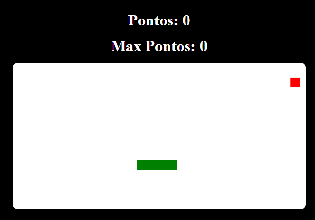

# Jogo Da Cobrinha

## Descrição do Jogo

* O Jogo da Cobrinha é um clássico onde o jogador controla uma cobra que deve comer o máximo de maçãs possível sem colidir com as paredes ou consigo mesma. A cada maçã comida, a cobra cresce, tornando o desafio cada vez maior.

## Como Jogar

* Use as teclas WASD para mover a cobra:

    W - Cima

    A - Esquerda

    S - Baixo

    D - Direita

* O objetivo é coletar o maior número possível de maçãs.
* Evite colidir com as paredes ou com o próprio corpo da cobra. O jogo termina quando a cobra colide.

## Imagens do Jogo

    
    
    

